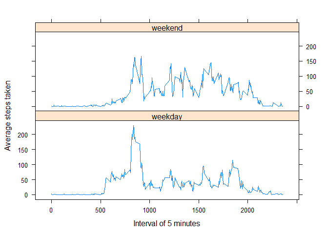

It is now possible to collect a large amount of data about personal movement using activity monitoring devices such as a Fitbit , Nike Fuelband, or Jawbone Up. These type of devices are part of the "quantified self" movement - a group of enthusiasts who take measurements about themselves regularly to improve their health, to find patterns in their behavior, or because they are tech geeks. But these data remain underutilized both because the raw data are hard to obtain and there is a lack of statistical methods and software for processing and interpreting the data.

## Loading and preprocessing the data

Reading the data 

```r
  #unzip the downloaded file
  data <- unzip("./activity.zip", exdir = "data")
  #read csv file
  activity <- read.csv("./data/activity.csv", header = TRUE, sep =  ",",na.strings  = "NA")
  #convert date column into date data structure
  activity$date <- as.Date(as.character(activity$date),"%Y-%m-%d")
  str(activity)
```

```
## 'data.frame':	17568 obs. of  3 variables:
##  $ steps   : int  NA NA NA NA NA NA NA NA NA NA ...
##  $ date    : Date, format: "2012-10-01" "2012-10-01" ...
##  $ interval: int  0 5 10 15 20 25 30 35 40 45 ...
```

```r
  head(activity)
```

```
##   steps       date interval
## 1    NA 2012-10-01        0
## 2    NA 2012-10-01        5
## 3    NA 2012-10-01       10
## 4    NA 2012-10-01       15
## 5    NA 2012-10-01       20
## 6    NA 2012-10-01       25
```

## What is mean total number of steps taken per day?

Mean of total number of steps taken per day is calculated below:

```r
  library(dplyr)
```

```
## Warning: package 'dplyr' was built under R version 3.4.3
```

```
## 
## Attaching package: 'dplyr'
```

```
## The following objects are masked from 'package:stats':
## 
##     filter, lag
```

```
## The following objects are masked from 'package:base':
## 
##     intersect, setdiff, setequal, union
```

```r
  stepsperday <- activity %>% 
            group_by(date) %>%
            summarize(total.steps = sum(steps, na.rm = T))
```

```
## Warning: package 'bindrcpp' was built under R version 3.4.3
```

```r
  #create histogram now
  hist(stepsperday$total.steps,breaks=20,xlab = "Total Steps per day", ylab = "Frequency", main = "Histogram of total number of steps per day")
```

<!-- -->

```r
  #Mean of the total steps taken per day
  mean(stepsperday$total.steps, na.rm = T)
```

```
## [1] 9354.23
```

```r
  #Median of the total steps taken per day
  median(stepsperday$total.steps, na.rm = T)
```

```
## [1] 10395
```

## What is the average daily activity pattern?

We will average the number of steps across each 5 min interval

```r
  avginterval <- activity %>%
              group_by(interval) %>%
              summarise(mean.steps = mean(steps,na.rm=T))
  plot(avginterval$interval, avginterval$mean.steps, type= "l",xlab = "Interval of 5 minutes", ylab = "Average steps taken", main = "Average daily activity pattern")
```

<!-- -->

```r
  #On an average across all the days in the dataset in 5 min interval, contains the maximum number of steps
  print(max(avginterval$mean.steps))
```

```
## [1] 206.1698
```

## Imputing missing values

We will calculate total number of missing values

```r
  sum(is.na(activity$steps))
```

```
## [1] 2304
```

```r
  #total % of na values present
  mean(is.na(activity$steps))
```

```
## [1] 0.1311475
```
Fill the missing values with mean of the respective 5-min interval

```r
  #First create a new data from activity
  newactivity <- activity
  for(i in 1:nrow(newactivity)){
    if(is.na(newactivity$steps[i])){
      index <- newactivity$interval[i]
      value <- subset(avginterval,interval == index)
      newactivity$steps[i] <- value$mean.steps
    }
  }
  print("The new data set with missing values filled in is below:")
```

```
## [1] "The new data set with missing values filled in is below:"
```

```r
  head(newactivity)
```

```
##       steps       date interval
## 1 1.7169811 2012-10-01        0
## 2 0.3396226 2012-10-01        5
## 3 0.1320755 2012-10-01       10
## 4 0.1509434 2012-10-01       15
## 5 0.0754717 2012-10-01       20
## 6 2.0943396 2012-10-01       25
```
We will make histogram also calculate and report the mean and median total number of steps taken per day with this new data set

```r
  newstepsperday <- newactivity %>% 
            group_by(date) %>%
            summarise(total.steps = sum(steps, na.rm = T))
  hist(newstepsperday$total.steps,breaks=20,xlab = "Total Steps per day", ylab = "Frequency", main = "Histogram of total number of steps per day")
```

<!-- -->

```r
  #Mean of the new data set
  mean(newstepsperday$total.steps)
```

```
## [1] 10766.19
```

```r
  #Median of the new data set
  median(newstepsperday$total.steps)
```

```
## [1] 10766.19
```
The mean and median has increased from the original data and in the new data both mean and median are same.

## Are there differences in activity patterns between weekdays and weekends?

Create a new factor variable in the dataset with two levels - "weekday" and "weekend" indicating whether a given date is a weekday or weekend day

```r
  newactivity$day <-ifelse (weekdays(newactivity$date) %in% c("Saturday","Sunday"), "weekend", "weekday")
  newactivity$day <- as.factor(newactivity$day)
  str(newactivity)
```

```
## 'data.frame':	17568 obs. of  4 variables:
##  $ steps   : num  1.717 0.3396 0.1321 0.1509 0.0755 ...
##  $ date    : Date, format: "2012-10-01" "2012-10-01" ...
##  $ interval: int  0 5 10 15 20 25 30 35 40 45 ...
##  $ day     : Factor w/ 2 levels "weekday","weekend": 1 1 1 1 1 1 1 1 1 1 ...
```

```r
  newavginterval <- newactivity %>%
              group_by(day,interval) %>%
              summarise(mean.steps = mean(steps,na.rm=T))
  #plotting the graph
  library(lattice)
  xyplot(mean.steps ~ interval | day,data = newavginterval,type= "l",layout = c(1,2),xlab = "Interval of 5 minutes", ylab = "Average steps taken")
```

<!-- -->

We observe that, as expected, the activity profiles between weekdays and weekends greatly differ. During the weekdays, activity peaks in the morning.
